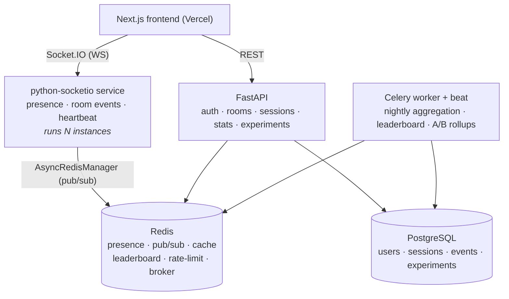

# StudySync — Real-Time Study Room Backend

A cozy online study room where people focus *together*: you join a room, start a
study session, and see everyone else's cartoon character in real time — who's
deep in focus, who's on a break — with a coins/levels reward system on top.

> **This project is built as backend infrastructure, not a website.** The product
> surface exists to make hard backend problems real: real-time presence across
> multiple server instances, Redis-backed state, async aggregation pipelines,
> product experimentation (A/B testing), automated testing, and cloud deployment.

## Why it's interesting (engineering)

- **Real-time presence over WebSockets** with **Redis-backed state** and reconnect recovery.
- **Redis Pub/Sub** fans room events across **N backend instances** — clients on
  different servers see each other (horizontal scale).
- **REST APIs** for rooms / sessions / analytics, with **server-side anti-cheat**
  on study time and **automated integration + WebSocket tests**.
- **Async Celery workers** roll up daily study stats; **Redis-cached leaderboard**.
- **A/B testing module** with deterministic user bucketing + exposure/metric event logging.
- Dockerized, deployed to the cloud, with **structured logs + Prometheus metrics**.

## Architecture



The realtime layer is a **separate ASGI service** so multiple instances can run
behind a load balancer and share room state through Redis. That's the core
distributed-systems story: a broadcast on instance A reaches a client connected
to instance B via Redis pub/sub.

## Stack

| Layer        | Choice |
|--------------|--------|
| API          | FastAPI (async), Pydantic v2 |
| Realtime     | python-socketio + `AsyncRedisManager` |
| Async jobs   | Celery (Redis broker) + beat |
| Data         | PostgreSQL (SQLAlchemy 2.0 async, Alembic) |
| Cache/RT     | Redis |
| Frontend     | Next.js (App Router, TS, Tailwind) |
| Tests        | pytest · httpx · python-socketio test client |
| Observability| structlog (JSON) · Prometheus metrics |
| Deploy       | Docker · Fly.io / Render · Neon · Upstash · Vercel |

## Run it locally

**Backend only (no Docker needed — uses [uv](https://docs.astral.sh/uv/)):**

```bash
cd backend
uv sync
uv run uvicorn app.main:app --reload
curl http://localhost:8000/health      # {"status":"ok",...}
uv run pytest
```

**Full stack (needs Docker):**

```bash
docker compose up --build
curl http://localhost:8000/health
```

## Roadmap

- [x] **Phase 0** — Scaffolding: FastAPI skeleton, config, structured logging, async DB + Alembic, pytest, Docker, CI.
- [ ] **Phase 1** — Auth (JWT), rooms CRUD, session lifecycle with server-side time validation.
- [ ] **Phase 2** — Real-time presence: python-socketio + Redis, multi-instance pub/sub, reconnect recovery.
- [ ] **Phase 3** — Celery workers: daily aggregation, Redis-cached leaderboard.
- [ ] **Phase 4** — A/B testing: deterministic bucketing, exposure/metric logging.
- [ ] **Phase 5** — Frontend MVP with animated characters.
- [ ] **Phase 6** — Deploy + Prometheus metrics + docs.
