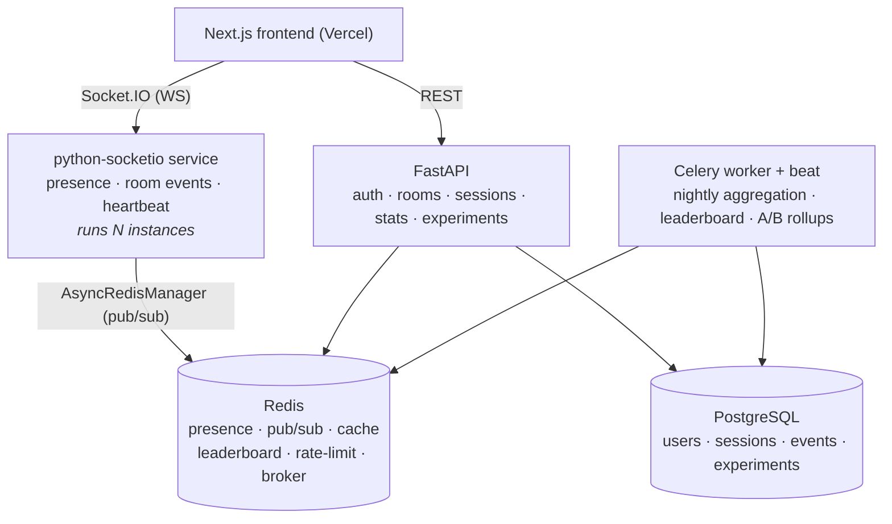

# StudySync — Real-Time Study Room Backend

A cozy online study room where people focus *together*: you join a room, start a
study session, and see everyone else's cartoon character in real time — who's
deep in focus, who's on a break — with a coins/levels reward system on top.

> **This project is built as backend infrastructure, not a website.** The product
> surface exists to make hard backend problems real: real-time presence across
> multiple server instances, Redis-backed state, async aggregation pipelines,
> product experimentation (A/B testing), automated testing, and cloud deployment.

## Why it's interesting (engineering)

- **Real-time presence over WebSockets** with **Redis-backed state** and reconnect recovery.
- **Redis Pub/Sub** fans room events across **N backend instances** — clients on
  different servers see each other (horizontal scale).
- **REST APIs** for rooms / sessions / analytics, with **server-side anti-cheat**
  on study time and **automated integration + WebSocket tests**.
- **Async Celery workers** roll up daily study stats; **Redis-cached leaderboard**.
- **A/B testing module** with deterministic user bucketing + exposure/metric event logging.
- **Server-authoritative game economy**: XP/coins/levels granted only from
  server-verified focus time and word reviews (client can render coins, never mint them).
- **Spaced-repetition vocabulary** (Leitner boxes) practiced inside focus sessions.
- Dockerized, deployed to the cloud, with **structured logs + Prometheus metrics**.

## Architecture



The realtime layer is a **separate ASGI service** so multiple instances can run
behind a load balancer and share room state through Redis. That's the core
distributed-systems story: a broadcast on instance A reaches a client connected
to instance B via Redis pub/sub.

## Stack

| Layer        | Choice |
|--------------|--------|
| API          | FastAPI (async), Pydantic v2 |
| Realtime     | python-socketio + `AsyncRedisManager` |
| Async jobs   | Celery (Redis broker) + beat |
| Data         | PostgreSQL (SQLAlchemy 2.0 async, Alembic) |
| Cache/RT     | Redis |
| Frontend     | Next.js (App Router, TS, Tailwind) |
| Tests        | pytest · httpx · python-socketio test client |
| Observability| structlog (JSON) · Prometheus metrics |
| Deploy       | Docker · Fly.io / Render · Neon · Upstash · Vercel |

## Run it locally

**Backend only (no Docker needed — uses [uv](https://docs.astral.sh/uv/)):**

```bash
cd backend
uv sync
uv run uvicorn app.main:app --reload --port 8010
curl http://localhost:8010/health      # {"status":"ok",...}
uv run pytest
```

**Frontend** (Next.js; expects the API on :8010 and realtime on :8001):

```bash
cd frontend
npm install
npm run dev          # http://localhost:3000
```

**Realtime service** (presence; scale it horizontally by running several):

```bash
uv run uvicorn app.realtime.asgi:app --port 8001
uv run uvicorn app.realtime.asgi:app --port 8002   # second instance, same Redis
# clients on :8001 and :8002 see each other — broadcasts fan out via Redis pub/sub
```

**Worker** (daily aggregation + leaderboard):

```bash
uv run celery -A app.workers.celery_app worker -B -l info
```

**End-to-end smoke test** (two headless browsers proving live presence;
needs API + realtime + frontend running):

```bash
uv run --with playwright python scripts/e2e_smoke.py   # E2E_BASE_URL to override :3000
```

**Full stack (needs Docker):**

```bash
docker compose up --build
curl http://localhost:8010/health
```

## Observability

- **Structured logs** — JSON in prod (`LOG_JSON=true`), colored console in dev (structlog).
- **Metrics** — `GET /metrics` (Prometheus): automatic HTTP request count/latency/in-progress via instrumentator, plus custom business counters (`studysync_sessions_started_total`, `studysync_experiment_exposures_total{experiment,variant}`).
- **Health** — `/health` (liveness) and `/health/ready` (Postgres + Redis) on the API; `/health` on the realtime service.

## Deploy

One-file [Render Blueprint](./render.yaml) provisions everything (API + realtime + worker + managed Postgres + Redis):

```
push to GitHub → Render Dashboard → New → Blueprint → select repo
```

Migrations run on API start (`alembic upgrade head && uvicorn ...`). `JWT_SECRET` is generated for the API and shared to the realtime service; set `CORS_ORIGINS` to your frontend origin. The same `DATABASE_URL` is normalized per service (asyncpg for the async API/realtime, psycopg for the sync worker).

**Free tier:** API + realtime + Postgres + Redis run on Render's free plan. The Celery **worker is paid-only** on Render (no free worker plan), so it's documented (commented) in the blueprint — enable it on a paid plan, or run it locally against the production `DATABASE_URL`/`REDIS_URL`. The live API + real-time presence demo works fully without it.

**Frontend (Vercel, free tier):** import the repo, set the root directory to
`frontend/`, and add two env vars pointing at the Render services:

```
NEXT_PUBLIC_API_URL=https://<api-service>.onrender.com
NEXT_PUBLIC_REALTIME_URL=https://<realtime-service>.onrender.com
```

Then set `CORS_ORIGINS` on the Render API service to the Vercel URL.

## Roadmap

- [x] **Phase 0** — Scaffolding: FastAPI skeleton, config, structured logging, async DB + Alembic, pytest, Docker, CI.
- [x] **Phase 1** — Auth (JWT + bcrypt), rooms CRUD, session lifecycle with server-side anti-cheat timing, event log, readiness probe, 13 tests.
- [x] **Phase 2** — Real-time presence: python-socketio + `AsyncRedisManager`, JWT handshake auth, join/leave/status, heartbeat + lazy-TTL staleness, room capacity, per-connection rate limiting, snapshot-based reconnect recovery. Includes a **two-instance test proving cross-process pub/sub fan-out**.
- [x] **Phase 3** — Celery worker + beat (sync psycopg engine): nightly per-user study aggregation (idempotent upserts, completion rate), **Redis-cached leaderboard** (sorted set), `/stats/me` + `/stats/leaderboard` endpoints, 6 tests.
- [x] **Phase 4** — A/B testing: SHA-256 **deterministic bucketing**, persisted assignments, exposure + outcome metric event log, per-variant results (completion rate), feature flags with **percentage rollouts**, 7 tests.
- [x] **Phase 6** — Observability (Prometheus `/metrics`: HTTP + custom business counters), production config ($PORT, CORS allowlist, DB-URL normalization, realtime `/health`), one-file **Render Blueprint** (`render.yaml`) provisioning API + realtime + worker + Postgres + Redis.
- [x] **Phase 5** — Frontend MVP: Next.js 16 (App Router, strict TS, Tailwind v4). Live room with **animated SVG characters at desks** (lamp on = focusing, coffee = break, zzz = idle), Socket.IO presence with heartbeat + reconnect re-join, session timer driven by server-side `last_resumed_at`, stats + leaderboard pages. Verified end-to-end with a **two-browser Playwright script** (cross-client presence + live status flips).
- [x] **Phase 7** — Gamification loop: ending a session grants **coins + XP from server-verified focus time** (1/minute); **word flashcards** (50-word seeded deck, Leitner spaced repetition, `/words/practice` + review endpoints) practiced during sessions grant XP and a coin per 5 correct; levels derive from XP; **adventure map** where your character walks a 7-stop night road (Dorm Desk to The Summit) as XP accrues. Reward animations: coin count-up, level-up banner, floating XP toasts, card flip.
